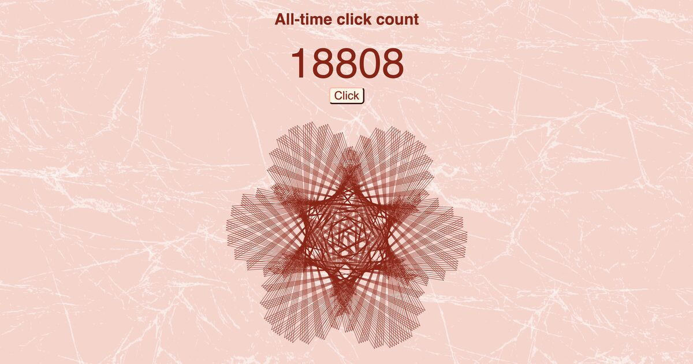

# click-counter

A global click counter where every count draws its own rose.

Live: https://counter.maricakes.de



Press the button to increase the all-time counter. The new count `n` is used to draw a variation of a [Maurer rose](https://en.wikipedia.org/wiki/Maurer_rose).

* Valid counts are whole numbers from 1 to 94,906,265. Above this, `n * n` is no longer exact in a JavaScript double.
* The count is stored as an 8-byte big-endian integer in `/var/lib/counter/count.bin`.
* `nginx-counter.conf` contains the nginx server configuration.
* Updates are protected by `flock`, so simultaneous clicks cannot lose increments.
* `click.php` is rate-limited to 5 requests per second per IP, with a burst of 10. Further requests receive `429`.

## Running it yourself

1. Create the counter directory and allow PHP-FPM to write to it:

   ```bash
   sudo mkdir -p /var/lib/counter
   sudo chown www-data: /var/lib/counter
   ```

   The counter file is created automatically on the first click.

2. Serve this directory with nginx and PHP-FPM, using `nginx-counter.conf` as a starting point. Adjust `server_name`, `root`, and the PHP-FPM socket path for your system.

3. Check the configuration and reload nginx:

   ```bash
   sudo nginx -t && sudo systemctl reload nginx
   ```
